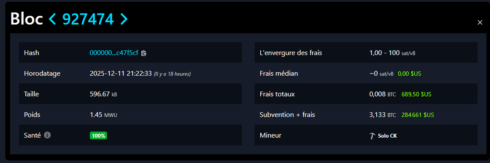

# TP - Crypto

## Exercice 1 : Découverte des fonctions de hachage (MD5 et  SHA-1)

MD5 :
- ENSEA | 0a5b32abdb2aaabb9f01d2b7d529aa3a
- eNSEA | 4725a60b2ce918046777d8dab211bd1a
- eNSeA | 848d38ed7319d081b15910d8875522f8
- EN5EA | 04ea3dc371590d20ee2870c845f76fb9

Lorem Ipsum : 00a0b62f6d780b2f751bef0bef712f8c

SHA-1 : 
- ENSEA | e0ccd5c03e1357c13eaa4f6236ea8cd7bfcee8da
- eNSEA | 3ec865b950694e14bf5a53754be2c3ec5bdb961e
- eNSeA | e75fe77bd5ac51bd29e8645de8f9dd857b894c8c
- EN5EA | 54ed4ee67fd5916f4709b2c28327deb9eec397ea

Lorem Ipsum : 252778f95c0fdad122def4bbca4eacf39cb0afc8

### 1.1 / Chaque modification entraine la génération d'un Hash différent : l'effet avalanche est vérifié

### 1.2 / On obtient un Hash de meme longueur. La résistance aux collision semble compromise.

### 1.3 / Pour SHA-1, on remarque que la modification de la fin du message ne modifie pas le Hash. Cela s'explique par la segmentation par bloc pour le hashage. En revanche pour MD5, j ne rencontre pas ce probleme. C'est l'effet avalanche. La résistance à la Seconde Préimage semble compromise.

### 1.4 / Aujourd'hui, il est facile de creer 2 fichiers différent qui seront hasher de la meme facon par SHA-1 ou MD5. Pour la protetion de mot de passe on utilisera alors SHA-2 SHA-3 ou d'autrse fonctions tel que Argon2.

### 1.5 / Le but de sel est d'ajouter une valeur aléatoire au mot de passe avant de la hasher. Cela permet de nulifier les tables de hashage précalculé et de rendre impossible l'identification de 2 utilisateurs ayant le meme mot de passe 

## Exercice 2
J'ai fait mes observations sur l'intranet de l'ensea :
- Nom du sujet
<br>Pays FR
<br>État / Province Île-de-France
<br>Localité Cergy
<br>Organisation ECOLE NATIONALE SUP. DE <br>L'ELECTRONIQUE ET DE SES APPLICATIONS
<br>Nom courant intranet.ensea.fr 

- Nom de l’émetteur
<br>Pays GR
<br>Organisation Hellenic Academic and Research Institutions CA
<br>Nom courant GEANT TLS ECC 1 

- Validité
<br>Pas avant
<br>Tue, 26 Aug 2025 13:03:29 GMT
<br>Pas après
<br>Wed, 26 Aug 2026 13:03:29 GMT 

- Informations sur la clé publique
<br>Algorithme Elliptic Curve
<br> Taille de la clé 256
<br> Valeur publique
04:9B:56:73:E0:42:7B:92:9C:52:67:43:12:66:D8:0D:1D:21:27:5B:C7:4B:3A:79:52:77:4B:EA:DE:55:6F:77:C9:FC:D3:C9:C5:E5:B4:6F:2B:DC:C1:7A:46:4E:FC:A9:44:50:00:F7:BC:92:92:9F:DB:F9:B3:3E:C9:91:90:55:FF

- Algorithme de signature ECDSA with SHA-384

- empreinte numéEmpreintes numériques
SHA-256 11:F5:A6:09:E7:D7:87:28:F9:97:F7:C9:42:12:B8:24:96:A7:DD:F3:38:E5:29:9C:3D:6B:80:0F:E2:98:6B:98
SHA-1 96:9C:82:42:B4:BA:E4:23:AB:4D:89:36:45:33:40:99:47:82:EC:CE

- Une autorité de certification est un organisme intermédiaire entre l'émetteur et le recepteur qui va vérifier l'identité du demandeur et signer son certificat avec sa propre clé privée.
- Une Infrastructure à Clé Publique (PKI) gère la création, l'émission et la validation des certificats numériques, l'authentification des utilisateurs et des dispositifs, et la protection des communications via le chiffrement. Elle assure également le cycle de vie des certificats (renouvellement et révocation) et contribue à la conformité aux normes de sécurité, établissant une chaîne de confiance.

- Chaîne de Confiance :
<br>L’utilisateur génère une paire de clés (publique/privée).
<br>Il crée une demande de signature (CSR) contenant :
Sa clé publique.
Ses informations d’identité.
<br>Il soumet le CSR à la RA avec les justificatifs.
<br>La RA vérifie l’identité et transmet à la CA.
<br>La CA signe le certificat avec sa clé privée pCA.
<br>Le certificat signé est renvoyé à l’utilisateur.
<br>La clé privée reste toujours chez l’utilisateur (ou Key Escrow).

- Lorsqu'un certificat numérique est révoqué, il perd sa validité avant sa date d'expiration, ce qui peut entraîner des restrictions d'accès pour les utilisateurs et signaler un problème de sécurité.

Pour vérifier la révocation d'un certificat, deux méthodes sont couramment utilisées :

    Liste de Révocation de Certificats (CRL) : Une liste émise par l'autorité de certification (CA) contenant les certificats révoqués. L'utilisateur doit régulièrement télécharger cette liste pour vérifier un certificat.

    Protocole de Statut de Certificat en Ligne (OCSP) : Une méthode en temps réel permettant de vérifier instantanément l'état d'un certificat en envoyant une requête à un serveur OCSP.

    - Les extensions présents dans le certificat serve de description :
    Subject Alternative Name : indique les différents nom de domaine par lesquelles la page est accessible
    Key Usage : spécifie l'utilisation prévu du certificat
    Extended key : permet de savoir qui va l'utiliser en l'occurrence souvent le serveur et le client
    et il y a des ID comme Subject Key ID, Authority Key ID.

- comme son nom l'indique, un certificat auto signé est un certificat de clé publique qu'un utilisateur émet en son propre nom, par opposition à un certificat émis par une autorité de certification. Un tel certificat est facile à produire et ne coûte rien. Cependant, il ne fournit aucune valeur de confiance.

## Exercice 3 : Cryptanalyse du chiffre de Vigenère

### 3.1 / 
Pour un intervalle de 7, voici les IC correspondant : 

- 0.06491,  0.07298,  0.09579,  0.06947,  0.07404,  0.06316,  0.08386

### 3.3 / 
On retrouve que 5 mod(7) donne un IC de 0.7404 proche de celui du francais. On en conclu donc que la chaine semble etre de longueur 7. 

### 3.4 / 
A l'aide du code vigenere.py on obtient les graphique présent dans le dossier output.

A partir de ses graphes on obtient le décalage et donc la clef suivante : 

- ENSEAIS ! 

### 3.5 / 
L’indice de coïncidence est efficace pour attaquer le chiffre de Vigenère car il aide à deviner la longueur de la clé en mesurant la probabilité que deux lettres aléatoires soient identiques. En divisant le texte chiffré selon cette longueur, on obtient des sous-textes ressemblant à des chiffres de César avec un indice de coïncidence caractéristique, ce qui facilite la détection des décalages et donc la clé. Cette méthode permet ainsi de casser le chiffre en exploitant les régularités statistiques des langues naturelles.​

### 3.6 / 
A l'aide du code kasiski.py, on obtient 53 occurences avec un longueur de 7. Plus le texte est long plus il sera precis. 

### 3.7 / 
La clef One-Time Pad est a usage unique. elle doit faire la taille du message pour assurer la confidentialité du message 

### 3.8 /
Cependant il ne faut pas la réutiliser. Au quel cas, on peut ajouter les différents messages et ré-appliquer les méthodes précédentes pour retrouver la clef.

### 3.9 /
Par conséquence, non il ne faut pas réutilisé la meme clef.

## Exercice 4

### 4.4.1
Un bloc Bitcoin est une unité fondamentale de la blockchain, comprenant plusieurs éléments clés.

#### 1. En-tête de Bloc
L'en-tête contient des informations essentielles :
- **Version** : Indique la version du logiciel.
- **Hash du bloc précédent** : Référence le bloc précédent, garantissant la continuité.
- **Merkle Root** : Représente l'ensemble des transactions via une structure Merkle.
- **Timestamp** : L'heure de création du bloc.
- **Difficulté** : Spécifie la difficulté du réseau pour miner le bloc.
- **Nonce** : Utilisé pour trouver un hash valide lors du minage.

#### 2. Transactions
Chaque bloc contient une liste de transactions valides, comprenant des entrées (références aux transactions précédentes) et des sorties (montants et adresses des destinataires).

#### 3. Taille du Bloc
La taille totale, limitée à 1 Mo, inclut toutes les transactions et métadonnées.

#### 4. Frais de Transfert
- Un bloc Bitcoin est une unité fondamentale de la blockchain, comprenant plusieurs éléments clés.

#### 1. En-tête de Bloc
L'en-tête contient des informations essentielles :
- **Version** : Indique la version du logiciel.
- **Hash du bloc précédent** : Référence le bloc précédent, garantissant la continuité.
- **Merkle Root** : Représente l'ensemble des transactions via une structure Merkle.
- **Timestamp** : L'heure de création du bloc.
- **Difficulté** : Spécifie la difficulté du réseau pour miner le bloc.
- **Nonce** : Utilisé pour trouver un hash valide lors du minage avec pour but de garantir l'unicité du bloc.

#### 2. Transactions
Chaque bloc contient une liste de transactions valides, comprenant des entrées (références aux transactions précédentes) et des sorties (montants et adresses des destinataires).

#### 3. Taille du Bloc
La taille totale, limitée à 1 Mo, inclut toutes les transactions et métadonnées.

#### 4. Frais de Transfert
Les frais associés aux transactions sont versés aux mineurs pour leur validation.
Ces éléments garantissent la sécurité et l'intégrité de la blockchain Bitcoin.

### 4.4.2
La taille moyenne d’un bloc Bitcoin varie en fonction de l’activité du réseau et des transactions incluses. Voici les points clés :

Taille maximale théorique : 1 Mo pour le bloc de base (depuis le protocole original), mais avec SegWit et les optimisations, la taille effective peut atteindre environ 4 Mo en poids.
Taille moyenne actuelle : généralement entre 1,3 Mo et 2,5 Mo par bloc, selon la congestion du réseau et l’utilisation de SegWit.
Intervalle de création : un bloc est miné en moyenne toutes les 10 minutes.

### 4.4.3
Étapes de la création d’un nouveau bloc
La création d’un bloc :

- la collecte des transactions en attente dans le mempool (La mempool est la “file d’attente” des transactions Bitcoin non confirmées. Chaque transaction validée par un nœud y reste temporairement jusqu’à ce qu’un mineur la sélectionne pour l’insérer dans un bloc.
). Ces transactions sont regroupées et vérifiées pour s’assurer qu’elles respectent les règles du protocole (signatures valides, absence de double dépense).
- Ensuite, le mineur construit l’en-tête du bloc, qui contient notamment le hash du bloc précédent, un horodatage, la racine de l’arbre de Merkle des transactions et le fameux nonce. Le mineur modifie ce nonce en permanence afin de trouver un hash qui respecte la difficulté imposée. Une fois ce hash valide trouvé, le bloc est considéré comme résolu et peut être diffusé au réseau.
- Les autres nœuds vérifient alors sa validité avant de l’ajouter à leur copie de la blockchain.

Le minage est le processus par lequel les mineurs utilisent leur puissance de calcul pour résoudre un problème cryptographique complexe. Concrètement, ils cherchent un hash de l’en-tête du bloc qui commence par un certain nombre de zéros, ce qui prouve qu’ils ont investi du travail (Proof-of-Work). Ce mécanisme joue plusieurs rôles essentiels : il permet de valider les transactions en les inscrivant dans un bloc, il sécurise le réseau en rendant les attaques extrêmement coûteuses, et il régule l’émission de nouveaux bitcoins en récompensant le mineur qui trouve le bloc. Sans minage, il n’y aurait ni consensus ni protection contre la falsification des données.

La difficulté est un paramètre qui détermine à quel point il est difficile de trouver un hash valide pour un bloc. Plus la difficulté est élevée, plus le nombre de calculs nécessaires augmente, ce qui demande davantage de puissance de calcul. Elle évolue automatiquement tous les 2016 blocs (environ toutes les deux semaines) afin de maintenir un temps moyen de 10 minutes par bloc. Si les mineurs deviennent plus nombreux ou plus puissants, la difficulté augmente pour compenser. À l’inverse, si la puissance totale du réseau diminue, la difficulté baisse. Ce mécanisme d’ajustement garantit la stabilité et la régularité de la blockchain.

À l’heure actuelle, au bloc numéro 924561, la difficulté du réseau Bitcoin impose que le hash d’un bloc valide commence par environ 19 zéros hexadécimaux en moyenne. Ce nombre de zéros est directement lié au niveau de difficulté : plus il y a de zéros requis, plus il est improbable de trouver un hash valide par hasard, et plus le travail de calcul est conséquent. Ce seuil évolue régulièrement en fonction de la puissance totale du réseau, mais au moment indiqué, la cible correspond à un hash avec ces 19 zéros initiaux, ce qui illustre bien la complexité croissante du minage.

**Réflexion sur la dérivation de la quantité maximale de bitcoins**

Le total maximum de bitcoins est de 21,000,000 BTC, ce qui découle d'une série géométrique. La première récompense est de 50 BTC par bloc. La formule de la somme infinie de cette série est :

$$
50 \times 210\,000 \times \sum_{n=0}^{\infty} \left( \frac{1}{2} \right)^n = 50 \times 210\,000 \times 2 = 21\,000\,000
$$

Je vais présenter les réponses sous forme numérotée avec des labels en gras pour plus de clarté.
## Récompenses et halving de Bitcoin

1. **Montant initial de la récompense (4.11):** 50 BTC par bloc.

2. **Particularité du bloc genesis, bloc #0 (4.12):** La récompense de 50 BTC du coinbase est techniquement spéciale et n’est pas dépensable; le bloc est “intégré en dur” et sert de point d’origine de la chaîne. Et bien évidemment il n'a pas de hash du block précédent.

3. **Message inscrit dans le bloc #0 (4.13):** “The Times 03/Jan/2009 Chancellor on brink of second bailout for banks”.

4. **Numéro du bloc du premier halving (4.14):** Bloc 210 000.

5. **Nouvelle récompense après le premier halving (4.15):** 25 BTC par bloc.

6. **Fréquence des halvings en blocs (4.16):** Tous les 210 000 blocs.

7. **Intervalle en années entre deux halvings (4.17):** Environ 4 ans.

8. **Nombre de halvings déjà survenus (4.18):** 4 (2012, 2016, 2020, 2024).

9. **Récompense actuelle par bloc (4.19):** 3,125 BTC.

10. **Année approximative du dernier bitcoin miné (4.20):** Vers 2140.

11. **Nombre total maximum de bitcoins (4.21):** 21 000 000 BTC.

### Garanties temporelles et consensus

**Question 4.22 :**  
- **10 minutes** est la cible moyenne.  

**Question 4.23 :**  
- Grâce au **réajustement de la difficulté** : si les blocs sont trouvés trop vite, la difficulté augmente ; trop lentement, elle diminue.  

**Question 4.24 :**  
- Tous les **2016 blocs**, soit environ toutes les **2 semaines**.  

**Question 4.25 :**  
- Les blocs seraient trouvés deux fois plus vite (≈5 min) jusqu’au prochain ajustement, où la difficulté serait doublée pour revenir à 10 min.  

**Question 4.26 :**  
- Chaque zéro supplémentaire dans le hash valide correspond à une difficulté multipliée par **16** (car chaque hexadécimal représente 4 bits).  

**Question 4.27 :**  
- Pour réduire le risque de **réorganisation de la chaîne** : une transaction dans un bloc récent peut être annulée si une autre chaîne concurrente devient plus longue.  

**Question 4.28 :**  
- Généralement **6 confirmations** (≈1 heure) sont considérées comme sûres pour des montants élevés.  

**Question 4.29 :**  
- C’est lorsqu’un acteur contrôle **plus de 50% de la puissance de calcul**.  
- Il peut alors réorganiser la blockchain, annuler ou modifier des transactions, et menacer la confiance dans le réseau.

## 4.4.6 Aspects cryptographiques

**Question 4.30 :**  
- Bitcoin utilise **SHA-256** (Secure Hash Algorithm 256 bits).  
- En fait, le minage applique **double SHA-256** : le hash est calculé deux fois pour renforcer la sécurité.  

**Question 4.31 :**  
- La sortie de SHA-256 est de **256 bits**, soit **64 caractères hexadécimaux**.  

**Question 4.32 :**  
- Le hash est calculé uniquement sur **l’en-tête du bloc** (block header), qui contient : version, hash du bloc précédent, Merkle root, horodatage, bits (cible de difficulté), et nonce.  

**Question 4.33 :**  
- Ils apparaissent comme des chaînes hexadécimales de 64 caractères.  
- Leur distribution semble aléatoire (pas de motifs visibles), mais beaucoup commencent par plusieurs zéros à cause de la difficulté imposée.  

**Question 4.34 :**  
- Les mineurs doivent trouver un **nonce** tel que le hash du bloc soit inférieur à une **cible de difficulté**.  
- Cela demande d’essayer énormément de valeurs de nonce jusqu’à ce que le hash respecte la condition.  

**Question 4.35 :**  
$$
\text{SHA256(SHA256(BlockHeader))} < \text{Target}
$$  
où *Target* est la valeur de difficulté définie par le protocole.  

**Question 4.36 :**  
- La difficulté actuelle (fin 2025) est d’environ **85 T (85 trillions)**.  
- Cela signifie qu’en moyenne, un mineur doit calculer environ $$ 8,5 \times 10^{13} $$ hashs pour trouver un bloc valide.  
- En pratique, c’est une valeur moyenne : certains blocs sont trouvés plus vite, d’autres plus lentement, mais sur le long terme cela converge vers 10 minutes par bloc.  

## 4.4.6 Analyse pratique

- ce block a été miné par un mineur solo sur la plateforme le 11/12/2025 ce qui le rend donc exceptionnel, ce fait rare est survenu sur la plateforme de minage solo appelé SoloCK.




## 4.4.6 Résumé rapide 

### Question 4.37 : Immutabilité des transactions
- Chaque bloc contient le **hash du bloc précédent**.  
- Modifier une transaction impliquerait de recalculer tous les blocs suivants, ce qui est **pratiquement impossible** à cause de la puissance de calcul requise.  
- Ce chaînage rend les transactions passées immuables.  

### Question 4.38 : Décentralisation et acteurs
- Bitcoin est décentralisé car il n’existe **aucune autorité centrale**.  
- Les acteurs sont :  
  - **Mineurs** (sécurisent le réseau via la preuve de travail).  
  - **Nœuds complets** (valident et propagent les transactions).  
  - **Utilisateurs** (envoient et reçoivent des bitcoins).  
- Le consensus est atteint collectivement.  

### Question 4.39 : Débit maximum théorique
- Le débit théorique de Bitcoin est limité par la taille des blocs (1 Mo) et leur fréquence (10 min).  
- Cela donne environ **3,3 à 7 transactions par seconde**.  
- En comparaison, **Visa peut traiter jusqu’à 65 000 TPS**.  
- Conclusion : Bitcoin est beaucoup plus lent que les systèmes de paiement traditionnels, ce qui explique les recherches sur des solutions de **scalabilité** (Lightning Network, SegWit).  

### Question 4.40 : Implications environnementales
- La preuve de travail consomme énormément d’énergie car elle nécessite des calculs intensifs.  
- Impact : **forte empreinte carbone**, dépendance aux énergies fossiles dans certains pays.  
- Alternatives proposées :  
  - **Proof of Stake (PoS)** : sélection des validateurs en fonction de leur mise en jeu (staking).  
  - **Proof of Authority (PoA)** ou autres mécanismes moins énergivores.  
- Ces alternatives réduisent la consommation énergétique mais posent des questions de sécurité et de centralisation.  

### Question 4.41 : Évolution du hashrate sur 6 mois
- Le hashrate est passé d’environ **850 EH/s en juin 2025** à plus de **1100 EH/s en décembre 2025**.  
- Cela montre :  
  - Une **croissance continue** de la puissance de calcul.  
  - Une **sécurité accrue** du réseau (plus difficile à attaquer).  
  - Un intérêt économique fort pour le minage malgré la baisse des récompenses (3,125 BTC).

## Exercice 5 : Analyse forensique d’une extension Chrome pour les crypto-actifs

### 5.1

### 5.2

### 5.3 
L'algorythme utilisé est AES
(https://github.com/MetaMask/browser-passworder/blob/main/src/index.ts)

### 5.4

#### 1. AES-CBC
Comment ça marche : Divise les données en blocs et chiffre chaque bloc en se basant sur le précédent.

Problème : Si un bloc est corrompu, tout le reste l’est aussi. Il ne vérifie pas si les données ont été modifiées.

#### 2. AES-GCM

Comment ça marche : Chiffre les données par un compteur, puis vérifie leur intégrité en même temps (en s'assurant qu'elles n'ont pas été modifiées).

Avantage : C’est rapide et sécurisé. Il garantit à la fois que les données restent confidentielles et intactes.

#### 3. AES-CTR

Comment ça marche : Chiffre les données avec un compteur unique qui change à chaque bloc.

Avantage : Très rapide, mais ne vérifie pas si les données ont été modifiées.

#### MetaMask ! 

Metamask utilise AES-GCM pour des raisons de rapidité et de securité. 

### 5.5 

```ts
export async function decrypt(
  password: string,
  text: string,
  encryptionKey?: EncryptionKey | CryptoKey,
): Promise<unknown> {
  const payload = JSON.parse(text);
  const { salt, keyMetadata } = payload;
  const cryptoKey = unwrapKey(
    encryptionKey ||
      (await keyFromPassword(password, salt, false, keyMetadata)),
  );

  const result = await decryptWithKey(cryptoKey, payload);
  return result;
}

export async function decryptWithKey<R>(
  encryptionKey: EncryptionKey | CryptoKey,
  payload: EncryptionResult,
): Promise<R> {
  const encryptedData = Buffer.from(payload.data, 'base64');
  const vector = Buffer.from(payload.iv, 'base64');
  const key = unwrapKey(encryptionKey);

  let decryptedObj;
  try {
    const result = await crypto.subtle.decrypt(
      { name: DERIVED_KEY_FORMAT, iv: vector },
      key,
      encryptedData,
    );

    const decryptedData = new Uint8Array(result);
    const decryptedStr = Buffer.from(decryptedData).toString(STRING_ENCODING);
    decryptedObj = JSON.parse(decryptedStr);
  } catch (e) {
    throw new Error('Incorrect password');
  }

  return decryptedObj;
}
```

#### Entrées necessaires

- Password
- Text chiffré

#### Etapes de dérivation de clé
- la clé est obte
- nue par un transformation du password avec le selt et les metadata

#### Sortie obtenues

- text décrypté

### 5.6 

La multiplication du nombre d'itération permet d'alonger le temps de calcul pour rendre impossible de brut force ou l'utilisation de RainbowTable
### 5.7

L'ajout du sel permet à 2 utilisateur d'avoir le meme password sans quand les hashages soit identique

### 5.8 
```py
from Cryptodome.Protocol.KDF import PBKDF2
from Cryptodome.Hash import SHA256
import base64

password = "123PetitsChats"
salt_base64 = "JR53k2vFWO11bPrXZLcCYEE01fxSQhTy/8oWaco0bIs="

salt = base64.b64decode(salt_base64)

key = PBKDF2(
    password=password.encode(),
    salt=salt,
    dkLen=32,  # 256 bits = 32 bytes
    count=600000,  # iterations
    hmac_hash_module=SHA256
)

print(f"Password: {password}")
print(f"Salt (Base64): {salt_base64}")
print(f"Salt (hex): {salt.hex()}")
print(f"Derived Key (hex): {key.hex()}")
print(f"Derived Key (Base64): {base64.b64encode(key).decode()}")
```
### 5.9

Le standard BIP39 définit un moyen de convertir une clé cryptographique aléatoire en une phrase mnémonique composée de mots, permettant de sauvegarder et de restaurer facilement un portefeuille.

- Entropie : Générer une séquence aléatoire de bits (128 à 256 bits).
- Phrase mnémonique : Convertir l’entropie en mots faciles à retenir (12 ou 24 mots).
- Seed binaire : Transformer la phrase mnémonique en une graine binaire (512 bits) via un algorithme sécurisé (PBKDF2).

Cela permet de sauvegarder et de restaurer un portefeuille cryptographique de manière sécurisée.

### 5.10

Une phrase mnémonique BIP39 peut contenir 12, 18 ou 24 mots, en fonciotn de la taille de la clé. Plus le nombre de mots est élevé, plus la clé est grande, ce qui rend la phrase mnémonique plus difficile à deviner ou à attaquer par force brute

### 5.11

```py
print("\n=== DÉCHIFFREMENT DES DONNÉES ===")
print(f"IV (hex): {iv.hex()}")
print(f"Encrypted data length: {len(ciphertext)} bytes")

print("\n=== DONNÉES DÉCHIFFRÉES ===")
cipher = AES.new(key, AES.MODE_GCM, iv)
decrypted_raw = cipher.decrypt(ciphertext)
print(decrypted_raw)
```

mnemonic : 
{110,97,112,107,105,110,32,115,116,97,105,114,115,32,97,108,108,111,119,32,116,114,97,112,32,108,105,103,104,116,32,99,97,117,116,105,111,110,32,115,99,105,115,115,111,114,115,32,99,97,115,104,32,116,121,112,105,99,97,108,32,119,105,110,116,101,114,32,98,101,116,116,101,114,32,99,104,97,105,114}


### 5.13

la phrase Mnemonic est :

napkin stairs allow trap light caution scissors cash typical winter better chair

### 5.14

m/44'/60'/0'/0/0
44 : BIP44
60 : ethereum
0 : Accounts
0 : chains


